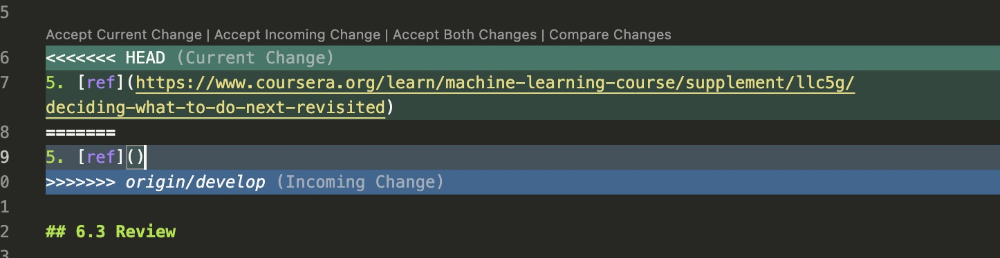

# github-demo
A simple demo repository to show the basic Git workflow


# Github command

# Github scenarios
## 1. You have divergent branches and need to specify how to reconcile them.
```bash
# Current branch status

... o --- o --- A --- B         origin/develop (upstream work)
                \
                   C --- D      main (my work)

# ref: https://stackoverflow.com/a/2452610
# you can either merge or rebase
# 1. merge
# the new merge, commit `M` has two parents
... o --- o --- A --- B                 origin/develop (upstream work)
                \              \
                   C --- D  --- M       main (my work)


$ git merge origin/develop

# fix conflict

# then force push to remote
$ git push -f 

```



```bash
# 2. rebase
# this tell git to replay commit C as if you had based it on commit B instead A
... o --- o --- A --- B                 origin/develop (upstream work)
                         \
                            C' --- D     main (my work)

$ git rebase origin/develop


```

<br><br><br>

## 2. Permission to RickZhou666/github-demo.git denied to RickZhou666.

```bash 
# log
remote: Permission to RickZhou666/github-demo.git denied to RickZhou666.
fatal: unable to access 'https://github.com/RickZhou666/github-demo.git/': The requested URL returned error: 403


# fix update to my gihub PAT 
$ git config credential.helper
>> /.codespaces/bin/gitcredential_github.sh

$ cat /.codespaces/bin/gitcredential_github.sh

$ sudo su
$ vi /.codespaces/bin/gitcredential_github.sh
>> 

# setup environment variable
# https://stackoverflow.com/a/234756
$ export GITHUB_TOKEN=<MY_GITHUB_TOKEN>
$ echo $GITHUB_TOKEN

# apply changes
$ source /.codespaces/bin/gitcredential_github.sh


```

